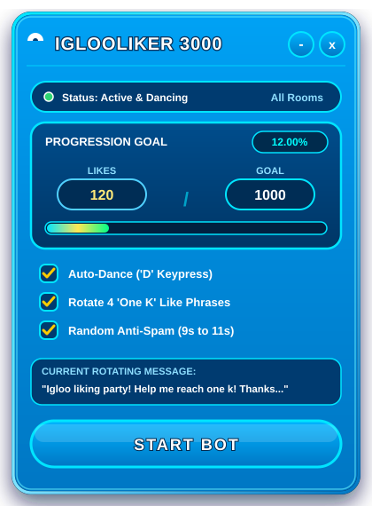

<div align="center">



<br />

[](https://play.cpjourney.net)
[-0072ff?style=for-the-badge&logoColor=white)](https://play.cpjourney.net)
[](https://github.com/caiovski)
[](./LICENSE)
[](https://www.tampermonkey.net/)
[](https://play.cpjourney.net)

<br />

<p align="center">
  <b>An authentic, non-intrusive automation tool crafted specifically for Club Penguin Journey.</b><br />
  Boost your igloo likes safely in background tabs with multi-penguin support, anti-AFK wave, and custom phrase studio.
</p>


</div>

## Overview

**IglooLiker 3000** is an automated assistant designed to help players reach their igloo like targets without risking server disconnection or locking the operating system's mouse and keyboard. Built with an authentic Club Penguin HUD interface (blue frame, cyan bevels, gold accents, and zero emojis), it combines native Yukon client simulation, multi-tab state isolation (`sessionStorage`), shared custom phrase management (`localStorage`), an anti-AFK wave loop, and 8-way window resizing.

<div align="center">
  
</div>


## Core Capabilities

<table>
  <tr>
    <td width="50%" valign="top">
      <h3>Multi-Penguin Tab Isolation</h3>
      <ul>
        <li><b>Per-Tab State (<code>sessionStorage</code>):</b> Runs multiple penguins across tabs (e.g., broadcaster dancing and spectator waving) without execution cross-contamination.</li>
        <li><b>Shared Phrases (<code>localStorage</code>):</b> Global custom phrase studio shared across all tabs with live real-time sync via <code>storage</code> events.</li>
        <li><b>Silent Mode:</b> Optional "Deactivate phrases" toggle to run actions without broadcasting chat messages.</li>
      </ul>
    </td>
    <td width="50%" valign="top">
      <h3>Phrases Studio Suite</h3>
      <ul>
        <li><b>Full Phrase CRUD:</b> Create, edit, and delete up to 6 custom phrases with inline validation and slot indicators.</li>
        <li><b>Active / Inactive Eye Filter:</b> Toggle individual phrases in/out of the rotation via SVG eye icons without deleting them.</li>
        <li><b>Smart Input:</b> Supports prompt fallback, autofocus, and <kbd>Enter</kbd> key submission.</li>
      </ul>
    </td>
  </tr>
  <tr>
    <td width="50%" valign="top">
      <h3>Action Engine &amp; Anti-AFK</h3>
      <ul>
        <li><b>Auto-Wave ('W'):</b> Dispatches native wave events to reset server inactivity timers and prevent disconnects.</li>
        <li><b>Sequential Alternation:</b> Alternates between dancing and waving when both are enabled.</li>
        <li><b>Action Repeater Slider:</b> Animated snow-to-orange slider (5s-10s) with live interval pills.</li>
      </ul>
    </td>
    <td width="50%" valign="top">
      <h3>Club Penguin Authentic UI</h3>
      <ul>
        <li><b>Bilingual Selector:</b> Instant real-time UI switching between English (USA) and Português (Brasil).</li>
        <li><b>8-Way Window Resizing:</b> Resize from any edge or corner with proportional <code>--cpj-scale</code> typography.</li>
        <li><b>Smart Minimize &amp; F5 Reset:</b> Collapses into an ultra-clean 56px header pill, with deterministic canonical reset on refresh (<kbd>F5</kbd>).</li>
      </ul>
    </td>
  </tr>
</table>


## Rotating Anti-Spam Phrases

To comply with the Club Penguin Journey chat filter and prevent automatic muting, the bot rotates through pre-configured phrases that state the 1,000 likes milestone using words (**"one k"**) instead of numeric digits, or any custom phrases configured in the **Studio** tab:

1. `"Igloo liking party! Help me reach one k! Thanks for your support"`
2. `"Drop a like at my igloo to help me reach one k! Much appreciated!"`
3. `"Working on my one k igloo likes goal! Any like helps a lot!"`
4. `"Please visit my igloo and leave a like for one k! Thank you so much!"`

> **Anti-Spam Delay Window:** The delay between messages dynamically jitters between **9 and 11 seconds** (`9000ms - 11000ms`), providing optimal safety against flood filters.


## Installation Guide

### Option 1: Tampermonkey / Violentmonkey (Recommended)

1. Install the [Tampermonkey Extension](https://www.tampermonkey.net/) in your web browser (Firefox, Chrome, Brave, or Edge).
2. Open the Tampermonkey Dashboard and click **Create a new script** (`+`).
3. Copy the entire contents of [`cpj_igloo_booster.user.js`](./cpj_igloo_booster.user.js).
4. Paste into the Tampermonkey script editor and save (<kbd>Ctrl</kbd> + <kbd>S</kbd>).
5. Navigate to [play.cpjourney.net](https://play.cpjourney.net) and log into your penguin.
6. The circular igloo launcher icon will appear in the top-right corner of the screen. Click it or press <kbd>F9</kbd> to open the control panel.

### Option 2: Browser Developer Console (Quick Test)

1. Open [play.cpjourney.net](https://play.cpjourney.net) in your browser and log in.
2. Press <kbd>F12</kbd> (or <kbd>Ctrl</kbd> + <kbd>Shift</kbd> + <kbd>I</kbd>) to open Developer Tools and navigate to the **Console** tab.
3. Paste the contents of [`cpj_igloo_booster.user.js`](./cpj_igloo_booster.user.js) into the console and press <kbd>Enter</kbd>.


## User Guide

```
+-------------------------------------------------------------------------+
| [HUD]                      IGLOOLIKER 3000                      [_] [X] |
+-------------------------------------------------------------------------+
| Status: Active & Dancing                                                |
| [ Language: English (USA)                                           v ] |
|                                                                         |
| Progress: 00.00%                                                        |
| Current Likes: [ 000 ] / Target Goal: [ 1000 ]                          |
| [======================== progress bar ===============================] |
|                                                                         |
| [ PHRASES ]             [ ACTIONS ]             [ STUDIO ]              |
|                                                                         |
| (Phrases Tab)                                                           |
| [X] Rotate like phrases                                                 |
| [X] Random anti-spam (9s to 11s)                                        |
| [ ] Deactivate phrases (Silent mode)                                    |
| Next Message: "Igloo liking party! Help me reach one k!..."             |
|                                                                         |
| (Actions Tab)                                                           |
| [X] Auto-Dance ('D')                                                    |
| [X] Auto-Wave ('W' - Anti-AFK)                                          |
| [X] Repeat action continuously                                          |
| Action Interval: [ 7s ] (5s ----------o---------- 10s)                  |
|                                                                         |
| (Studio Tab)                                                            |
| [ Type new phrase...                                  ] [ + ADD ]       |
| 1. "Igloo liking party!..."                   [Eye] [Edit] [Delete]     |
| Slots: 4/6                                                              |
|                                                                         |
| +---------------------------------------------------------------------+ |
| |                            START BOT                                | |
| +---------------------------------------------------------------------+ |
|                  Version 3.2.0 Made by Caiovski                         |
+-------------------------------------------------------------------------+
```

1. **Setting Your Goal & Language:**
   - Select your language (**English (USA)** or **Português (Brasil)**) from the dropdown above the progression card.
   - Click the **Target Goal** pill to enter your milestone (`1000`, `1500`, `2000`). Likes auto-detect from the Yukon client.
2. **Navigating the 3 Tabs:**
   - **Phrases:** Control rotation, anti-spam jitter (9s-11s), and silent mode.
   - **Actions:** Toggle Auto-Dance (`D`), Auto-Wave (`W` anti-AFK), alternating cycles, and continuous action repetition interval.
   - **Studio:** Create up to 6 custom phrases, edit existing ones, and toggle active/inactive phrases via the eye icon.
3. **Activating the Bot:**
   - Click **START BOT** (vibrant blue). The button switches to **PAUSE BOT** (warm red) and the status dot turns green.
   - The card footer displays `Version 3.2.0 Made by Caiovski` with an integrated hyperlink to [Caiovski's GitHub profile](https://github.com/caiovski).
   - Minimizing (`_`) shrinks the window to an ultra-compact 56px header pill.
   - Closing (`X`) hides the modal while keeping the bot running in the background until paused.
4. **Moving and Resizing:**
   - Drag anywhere via the header bar. Pull any of the 8 edge/corner resizers to adjust the window freely.
   - Pressing <kbd>F5</kbd> cleanly resets the card back to its canonical delimited dimensions (`370px × 500px`).


## Interactive Local Preview

You can test the entire user interface and logic locally without opening the game:

1. Open [`preview.html`](./preview.html) in any modern web browser.
2. The simulation environment loads the Welcome Room background and a simulated game chat log.
3. Click **START BOT** to inspect the simulated dance action, wave action, and chat log output in real time.
4. Test tab switching, phrase additions, eye toggling, language changing, and 8-way resizing.


## Repository Structure

```
iglooliker-3000/
|-- cpj_igloo_booster.user.js   # Complete standalone userscript (v3.2.0)
|-- preview.html                # Interactive local simulation preview
|-- README.md                   # Project documentation
|-- LICENSE                     # MIT License file
|-- assets/                     # Design mockups, UI reference sprites, banners, and SVGs
|   |-- header-banner.svg       # Animated header banner with blue frame and badges
|   |-- updates-banner.svg      # Animated update release banner with cyan border and snow
|   |-- animated-igloo-interactive.svg # Standalone SMIL click-toggle interactive igloo
|   |-- igloo-state-off.svg     # Idle offline igloo icon (Zzz sleeping state)
|   |-- igloo-state-on.svg      # Running online igloo icon (Weather vane, gusts & fire)
|   |-- modal-hud-preview.svg   # Vector graphic with clicking mouse animation
|   |-- divider.svg             # Animated frost blue diamond crystal divider
|   |-- footer-banner.svg       # Animated footer watermark with CAIOVSKI branding
|   |-- design/                 # Reference screenshots and UI layouts
|   `-- welcome room/           # Background assets
|-- core/                       # Modular business logic (< 250 lines)
|   |-- engine.js               # Background timer, auto-pause room/map monitor, chat dispatch
|   `-- state.js                # Per-penguin profiles, reactive state, cross-tab sync
|-- ui/                         # Modular user interface components (< 250 lines)
|   |-- components.js           # Modal DOM, floating bubble drag, dark prompt dialog
|   |-- icons.js                # SVG vector icons (spinning vane, classic igloo, heart badge)
|   `-- styles.css              # Club Penguin authentic styles, 3D snowball slider, cursors
|-- updates/                    # Technical sprint reports
|   `-- update/
|       |-- update_1.md         # Release 3.1.0 comprehensive architecture sprint report
|       `-- update_2.md         # Release 3.2.0 per-penguin profiles & safety sprint report
`-- openspec/                   # Technical architecture proposals, specs, and tasks
    `-- changes/
        |-- cpj-afk-igloo-booster/
        |-- multi-penguin-actions-studio/
        `-- penguin-profiles-and-auto-pause/
```


## 🕹️ Histórico de Updates Realizados (Sprint de Inovação)

<div align="center">
  
</div>

<br />

### 🔘 Interactive Igloo Launcher Showcase (Click to Toggle ON / OFF)

Test the interactive floating launcher directly inside this catalog. Click on the igloo below to toggle between **Offline / Sleeping State (OFF)** and **Live Automated Farming State (ON)** featuring the animated silver rooster weather vane, wind gusts, chimney smoke puffs, and warm glowing interior hearth:

<div align="center">

<details>
  <summary style="list-style: none; cursor: pointer; display: inline-block;">
    <br />
    
    <br />
    <kbd>👆 CLICK IGLOO TO TURN ON</kbd>
    <br />
    <sub><i>Status: Bot Offline • Sleeping Idle Mode</i></sub>
  </summary>
  <br />
  <a href="assets/animated-igloo-interactive.svg" target="_blank" title="Open Full Standalone Interactive Vector (SMIL Animated)">
    
  </a>
  <br />
  <kbd>✨ BOT ONLINE & FARMING • CLICK AGAIN ABOVE TO TOGGLE OFF</kbd>
  <br />
  <sub><i>Animations Active: Spinning Rooster Weather Vane • Continuous Wind Gusts • Chimney Smoke • Window Fire Hearth • Dynamic Diffuse Floor Light</i></sub>
  <br />
  <small><a href="assets/animated-igloo-interactive.svg" target="_blank">🔗 <i>Open standalone SMIL vector for native SVG click triggers</i></a></small>
</details>

</div>

<br />

### 1. Release 3.2.0 (NOVO!!!) — 23/09/2026: Per-Penguin Profiles, Auto-Pause Safety & Animated Launcher Suite
- **Per-Penguin Account Profiles (`cpj_penguin_{username}`):** Automatic detection of authenticated game user via Yukon client (`client.penguin.username`), creating isolated persistent profiles for target goals, current likes, dance/wave actions, and interval preferences without cross-account state contamination.
- **Auto-Pause Safety Engine:** Real-time room transition detection (`world.room.id`) and Map interface monitor (`'Map'` scene active, canvas click, and <kbd>M</kbd> hotkey) that automatically suspends bot loops into a safe idle state, preventing chat flooding and server disconnects when browsing or traveling.
- **Asynchronous Dark Prompt Dialog ("Telinha Preta"):** Replaced blocking browser `window.prompt()` with an in-DOM `#1c1b22` modal dialog, preserving WebSocket heartbeats during phrase editing and eliminating game canvas freeze-outs.
- **Authentic 3D Organic Snowball Slider:** Hand-packed snowball thumb geometry (28px) with discrete second snapping on an expanded 16px track with dynamic snow-to-amber progress styling.
- **Interactive Animated Igloo Launcher:** 72px floating launcher featuring a spinning silver rooster weather vane, 3 continuous wind gusts, chimney smoke puffs, glowing window fire, and sleeping offline states with smooth pointer interaction.
- **Ephemeral Per-Penguin Drag Memory & Dynamic Card Placement:** Pointer-based dragging with `sessionStorage` position persistence, pointer/grab cursor states, and dynamic positioning that places the modal card directly beneath the floating bubble wherever it moves.
- **Heart Badge & Header Alignment Polish:** Official pink heart badge (`#ff2a6d`) integrated into the modal header, enlarged 28px left title igloo icon with vertical baseline alignment, and classic smooth igloo icon restored to the progression section.
- **Comprehensive Sprint Report:** Detailed architectural documentation and data flow diagrams published in [`updates/update/update_2.md`](./updates/update/update_2.md).

### 2. Release 3.1.0 — 21/09/2026: Multi-Penguin Actions & Phrase Studio Suite
- **Multi-Tab State Segregation (`sessionStorage` vs `localStorage`):** Isolated per-tab execution (`autoDance`, `autoWave`, `repeatAction`, `actionInterval`, `deactivatePhrases`, `activeTab`, `running`) so multiple accounts (broadcasters and spectators) run independently in separate tabs without cross-tab state bleed.
- **Shared Phrases Repository with Real-Time Sync:** Custom phrases, active/inactive states, target goals, and language preference are persisted in `localStorage` and synchronized across all open penguin tabs in real time via native `storage` events.
- **Phrases Studio CRUD & Eye Filter:** Full phrase management (create, edit, delete, 6 slots max) with light gray eye toggle icons (closed eye = active/in rotation, open eye = inactive/excluded), empty-prompt fallback, autofocus, and <kbd>Enter</kbd> key support.
- **Action Engine & Anti-AFK Wave:** Added Auto-Wave (`KeyW`) anti-inactivity command, sequential alternating action cycles (Dance + Wave), and a continuous action repeater with an animated snow-to-orange interval slider (5s to 10s) that smoothly expands only when active.
- **Bilingual Interface (PT-BR / EN-USA):** Integrated Club Penguin styled dropdown above progression card for seamless instant interface localization.
- **8-Way Window Resizing & Proportional Scaling:** Added 8-direction edge and corner resizers with `--cpj-scale` dynamic CSS scaling (0.75x to 1.4x) and capture-phase event isolation preventing penguin walking on the game canvas.
- **Header-Only Minimize & Deterministic F5 Reset:** Collapses into a clean 56px header pill when minimized. Refreshing (<kbd>F5</kbd>) deterministically resets the card to its canonical delimiter size (370px × 500px) and position (top: 25px, right: 25px).
- **Comprehensive Sprint Report:** Detailed architectural documentation and data flow diagrams published in [`updates/update/update_1.md`](./updates/update/update_1.md).


## License & Copyright

Copyright (c) 2026 **CAIOVSKI**. All rights reserved.

This project is licensed under the **MIT License**. See the [`LICENSE`](./LICENSE) file for the full license terms and conditions.

### Disclaimer
Developed for educational and personal automation purposes. Club Penguin Journey is a community recreation project; this tool is unaffiliated with Disney, Disney Interactive, or CPJ staff.

<br />

<div align="center">
  <a href="https://github.com/caiovski">
    
  </a>
</div>

