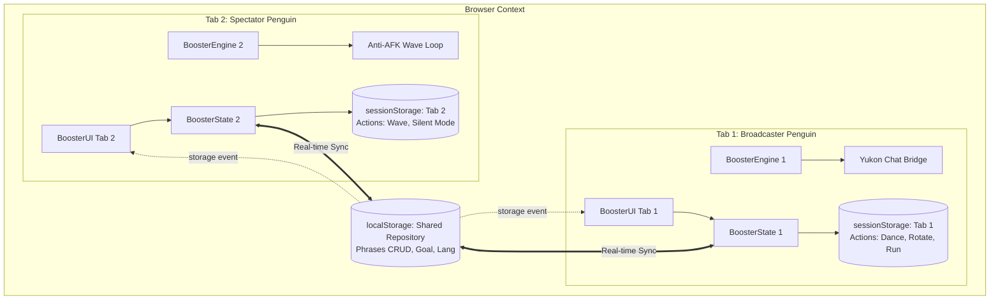

 

| Metric / Attribute | Specification | Status |
| :---: | :---: | :---: |
| **Release Version** | `3.1.0` (Production Userscript) |  |
| **Target Platform** | Club Penguin Journey (Yukon HTML5 / Phaser) |  |
| **Architecture** | Multi-Tab Storage Segregation (`sessionStorage` + `localStorage`) |  |
| **Modular Line Constraint** | opsx-build standard (< 250 lines per module) |  |
| **License** | MIT License (C) 2026 CAIOVSKI |  |

---

## Executive Summary

The **Multi-Penguin Actions & Phrase Studio Suite** (Release `3.1.0`) elevates **IglooLiker 3000** from a single-account like booster into a full-fledged, multi-tab automation suite. Designed specifically for players managing multiple accounts (e.g., a primary broadcasting account and secondary AFK spectators), this update introduces complete per-tab state segregation, custom phrase management with active/inactive filtering, an anti-AFK wave engine, 8-way window resizing with adaptive typography, and bilingual (PT-BR / EN-USA) localization.

---

## Architectural Overview & Data Flow

---

## Key Engineering Deliverables

### 1. Multi-Tab State Segregation (`sessionStorage` vs `localStorage`)
- **Isolated Per-Tab Execution (`sessionStorage`):**
  - Bot running status (`isRunning`), action choices (`autoDance`, `autoWave`, `repeatAction`), interval configuration (`actionInterval`), phrase deactivation (`deactivatePhrases`), and active tab view (`activeTab`) are isolated per browser tab.
  - Tab 1 can broadcast phrases and dance while Tab 2 runs silently in the background performing anti-AFK waves without state bleed.
- **Shared Domain Repository (`localStorage`):**
  - Custom phrases, active/inactive toggle flags, target goals, and language preference are shared across all tabs under `cpj_booster_shared`.
  - Added native `window.addEventListener('storage', ...)` sync: editing or toggling phrases in one tab immediately updates all open penguin tabs in real time.

### 2. Phrases Studio Suite (CRUD & Toggle Eye Filter)
- **Full Phrase CRUD:**
  - Create up to 6 custom phrases with inline character validation and slot counters (`Slots: N/6`).
  - Inline phrase editing via modal prompt and one-click deletion (`[X]`).
  - Added empty-field fallback prompt on `+ ADD` click, input autofocus, and <kbd>Enter</kbd> keypress submission.
- **Active / Inactive Eye Toggle:**
  - Integrated custom SVG eye icon (`eyeClosed` = Active / in rotation, `eyeOpen` = Inactive / excluded).
  - Allows selecting specific phrases for rotation without deleting unused entries.

### 3. Action Engine: Anti-AFK Wave & Continuous Action Repeater
- **Auto-Wave (`W` keypress):**
  - Dispatches native `KeyW` events to reset server inactivity timers without moving the penguin.
- **Alternating Action Cycle:**
  - When both Auto-Dance and Auto-Wave are active, the engine alternates sequentially between them every cycle.
- **Smooth Action Interval Slider:**
  - Horizontal snow-to-orange slider (5s to 10s) with live indicator pill (`[ 7s ]`).
  - Smooth CSS expansion/collapse animation (`max-height`, `opacity`, `transform: scaleY`) that automatically appears only when "Repeat action continuously" is checked.
- **Silent Mode (`deactivatePhrases`):**
  - Bypasses all chat DOM manipulation, allowing penguins to perform actions without sending chat messages.

### 4. 8-Way Window Resizing & Proportional Adaptive Scaling
- **Window-Style 8-Way Resizing:**
  - Added 8 edge and corner resizers (`n`, `s`, `w`, `e`, `nw`, `ne`, `sw`, `se`) allowing unrestricted resizing like a native desktop or browser window.
- **Reactive Scaling (`--cpj-scale`):**
  - Dynamically calculates scale ratios (`0.75` to `1.4`) based on width and height, smoothly scaling typography, inputs, icons, and buttons proportionally.
- **Canvas Click-Through Isolation:**
  - Comprehensive capture-phase event isolation (`mousedown`, `mouseup`, `click`, `pointerdown`, `pointerup`, `touchstart`, `touchend`, `contextmenu`).
  - Calls `e.preventDefault()` and `e.stopPropagation()` during window drags, guaranteeing penguins never walk on the game canvas underneath when moving or interacting with the card.

### 5. Smart Collapsing & Deterministic F5 Reset
- **Header-Only Minimize Mode:**
  - Collapses the card to an ultra-clean 56px header pill containing strictly the title and window controls (`[_]` expand and `[X]` close), matching authentic Club Penguin windowing.
- **Deterministic F5 Reset:**
  - Modal dimensions and position are kept strictly ephemeral in memory; refreshing the page (<kbd>F5</kbd>) immediately restores the canonical delimiter size (**370px × 500px**) and position (**top: 25px, right: 25px**).
- **Background Keepalive on Close:**
  - The `[X]` button hides the modal overlay (`cpj-closed`) while preserving all running intervals and background bot automation.

---

## Modular Architecture & Quality Metrics

All modular source files strictly adhere to the opsx-build standard (**< 250 lines per file**):

| Module File | Responsibility | Line Count | Status |
| :--- | :--- | :---: | :---: |
| [`core/state.js`](../../core/state.js) | Reactive state store, `sessionStorage`/`localStorage` sync, validation | **232 lines** | Passed (< 250) |
| [`core/engine.js`](../../core/engine.js) | Action dispatcher (Dance/Wave), background loop, Yukon chat bridge | **244 lines** | Passed (< 250) |
| [`ui/components.js`](../../ui/components.js) | Modal DOM creation, 8-way resizers, Studio CRUD, event isolation | **246 lines** | Passed (< 250) |
| [`ui/icons.js`](../../ui/icons.js) | Pure SVG vector dictionary (zero emojis, authentic CP sprites) | **135 lines** | Passed (< 250) |
| [`ui/styles.css`](../../ui/styles.css) | Club Penguin authentic design system, animations, slider styling | **797 lines** | Passed |
| [`cpj_igloo_booster.user.js`](../../cpj_igloo_booster.user.js) | Standalone consolidated userscript for Tampermonkey | **1944 lines** | Production Ready |

---

  <b>IglooLiker 3000 &bull; Release 3.1.0 Sprint Report</b> 
  Authored by <b>CAIOVSKI</b> &bull; 21/09/2026

