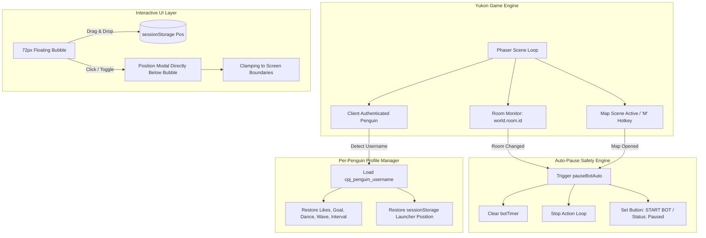

 

| Metric / Attribute | Specification | Status |
| :---: | :---: | :---: |
| **Release Version** | `3.2.0` (Production Userscript) |  |
| **Target Platform** | Club Penguin Journey (Yukon HTML5 / Phaser Engine) |  |
| **Per-Penguin Storage** | `cpj_penguin_{username}` Isolated Profiles |  |
| **Safety Engine** | Auto-Pause on Room Transition & Map Hotkey |  |
| **Animated Assets** | Silver Rooster Vane, Wind Gusts & Smoke |  |
| **Modular Constraint** | opsx-build standard (< 250 lines per module) |  |
| **License** | MIT License (C) 2026 CAIOVSKI |  |

---

## Executive Summary

**Release 3.2.0** delivers a major architectural and visual leap for **IglooLiker 3000**. Building upon the multi-tab foundations of Release 3.1.0, this sprint implements:
1. **Per-Penguin Account Profiles**: Automatic identification of the active logged-in penguin (`client.penguin.username`) with isolated permanent preferences (`cpj_penguin_{username}`), preventing multi-account overwrites.
2. **Auto-Pause Safety Engine**: Real-time room transition monitoring and map interface detection (`'Map'` scene, canvas click, and <kbd>M</kbd> hotkey) that automatically suspends bot loops into a safe idle state.
3. **In-DOM Asynchronous Dark Prompt ("Telinha Preta")**: Replacement of blocking native `window.prompt()` with an asynchronous `#1c1b22` DOM dialog, maintaining WebSocket heartbeats during phrase editing and eliminating game disconnects.
4. **Authentic 3D Organic Snowball Slider**: Hand-packed snowball thumb geometry (28px) with discrete second snapping on an expanded 16px track.
5. **Interactive Animated Igloo Launcher**: A 72px floating launcher featuring a spinning silver rooster weather vane, 3 continuous wind gusts, chimney smoke puffs, glowing window fire, and sleeping offline states.
6. **Ephemeral Per-Penguin Drag Memory & Dynamic Card Placement**: Pointer-based dragging with `sessionStorage` position persistence, pointer/grab cursor states, and dynamic positioning that places the modal card directly beneath the floating bubble wherever it moves.
7. **Heart Badge & Header Polish**: Official pink heart badge (`#ff2a6d`) integrated into the modal header, enlarged 28px left title igloo icon with vertical baseline alignment, and classic smooth igloo icon restored to the progression section.
8. **Card Footer Version & Author Link**: Native bottom credit `Version 3.2.0 Made by Caiovski` rendered beneath the START BOT button, with "Caiovski" styled in gold/yellow, underlined, and hyperlinked to GitHub (`https://github.com/caiovski`).

---

## Architectural Data Flow & Safety Pipelines

---

## Key Engineering Deliverables

### 1. Per-Penguin Profiles & Ephemeral Position Memory
- **Dedicated Keys (`cpj_penguin_{username}`)**: Each authenticated penguin maintains an isolated preferences record in `localStorage` for current likes, target goals, dance/wave toggles, and intervals.
- **Dynamic Identification**: The injected bridge monitors Yukon client authentication and switches profiles on login.
- **Session-Scoped Launcher Memory**: Dragging the floating bubble saves coordinates under `cpj_launcher_pos_${penguin}` in `sessionStorage`. Positions are retained across profile switches but automatically reset to the default top-right corner upon browser tab closure.

### 2. Auto-Pause Safety Engine
- **Room Transition Polling**: Tracks active room IDs (`world.room.id` / `client.room.id`). Changing rooms immediately clears timers, pauses automation, and flips the HUD toggle back to "START BOT".
- **Map Open Detection**: Detects map openings via scene state (`sc.scene.isActive('Map')`), canvas bottom-left map button clicks, and the <kbd>M</kbd> hotkey.

### 3. Asynchronous Non-Blocking Dark Prompt Modal
- **Non-Blocking Architecture**: Replaces synchronous `window.prompt()` with an asynchronous Promise-based DOM modal matching CPJ dark aesthetics (`#1c1b22`).
- **Connection Preservation**: Eliminates WebSocket freezes and game disconnects while editing phrases in the Studio.

### 4. Animated Igloo Launcher with Rooster Vane & Wind Gusts
- **Option 1 Vector Artwork**: Full SVG integration with silver gradient rooster weather vane, 3 undulating wind wave paths, stovepipe chimney with red lever, fire-lit window, and sleeping Zzz states.
- **Online / Offline Reactive Switching**: The launcher and modal synchronize seamlessly with the bot's running status (`.is-running`).

### 5. Floating Launcher Cursor Polish & Dynamic Placement
- **Pointer & Grab Cursors**:
  - Hover: Link pointer hand (`cursor: pointer !important;`).
  - Active Drag: Open hand (`cursor: grab !important;`).
- **Below-Bubble Dynamic Card Placement (`positionModalBelowLauncher`)**:
  - Measures the floating launcher bubble and computes modal positioning directly below the launcher (`lr.bottom + 10px`).
  - Implements viewport edge clamping (`maxTop = innerHeight - modalHeight - 12px`) and horizontal boundary checks.

---

## Verification & Quality Assurance

| Test Suite | Scope | Result |
| :--- | :--- | :---: |
| **Room Transition Auto-Pause** | Switching rooms cancels timers and resets toggle | ✅ Passed |
| **Map Open Auto-Pause** | Canvas click and 'M' key trigger immediate pause | ✅ Passed |
| **Per-Penguin Isolation** | Penguin A and Penguin B preserve independent likes/goals | ✅ Passed |
| **Launcher Drag & Drop** | Pointer capture drag with >5px movement suppression | ✅ Passed |
| **Dynamic Card Placement** | Modal opens directly below bubble across all quadrants | ✅ Passed |
| **Cursor Verification** | Hover: `pointer`; Dragging: `grab` | ✅ Passed |
| **Modular Line Constraint** | `ui/components.js` strictly under 250 lines (248 lines) | ✅ Passed |
| **Zero Emojis Doctrine** | 100% SVG vector iconography throughout all components | ✅ Passed |
